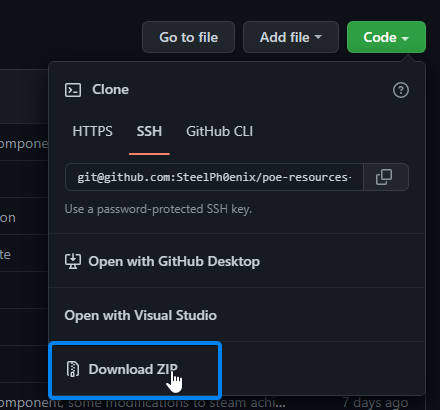

# Path of Exile Resources Center

This is the repository with PoERC source code. PoERC is made in Gatsby, with React, in Typescript/Styled Components.

Currently, there's not much docs because this project is in very early stages of development. When it'll reach the "beta" stage, i'll write up some docs on how to contribute and create pages.

## Project description

**This project is meant to be a site gathering ALL and ANY available Path of Exile community (and official) resources and knowledge.** Heavily inspired by <https://www.lastepochtools.com/> game guide.
It's also my first webdev project, so don't expect the corporation-grade quality (not yet at least).

At it's core, Path of Exile is a very "complicated" game, with incredible amount of content, incrementally added every 3 months (or-so). It isn't complicated without a reason - with the amount of content you have available, it's easy to get lost, especially if you're a beginner and you don't really know what you're looking for yet. There's plenty of sources with PoE knowledge - tutorials, build guides, reddit posts, and so on, but they are usually scattered through the internet, waiting for people to find them and use them in their playthroughts. Sure, there's official wiki, but in my opinion it's more of a "you'll find it there if you know what you're looking for" tool. There's also plenty of YouTube videos, but not everyone likes to watch long, several-hours series, just to get hang of the game basics (and i'm not saying that these are bad, seriously, go watch Zizaran's PoE Academy).

So, having that thought in mind, i've decided to try to create a website which would provide as much knowledge as possible, both from official sources and community. The content should be easily accessible and editable, so that anyone could contribute. I'd like to have a place where i could go, thinking about my next build, and just look up skills and integrations with them, maybe read some generic guides about some game mechanics, have all the data nicely linked together and presented in a tidy way. And i'd also like it to be a place where a new player could go and look up what's this game about, what's the content, how do you access it, and so on.

While writing this i had a thought that constantly said "hey, you're just writing about wiki right now, you can do it there too dummy", but i don't *want* this to be a 1:1 copy of wiki. Data presentation and order is important, and wiki is chaotic - you have *most* of the data, sure, but not all (datamining sites provide the rest - thank you PoE Ninja and PoEDB). Most of the content about items, skills, and other in-game objects is automatically generated. Sure, it's descriptive, but there's a lack of human touch - i personally lack guides about interactions between these items and mechanics, which sometimes can be found on wiki, but not always, and definitely not all of them. It usually also just dumps all the data on you in *some* order, including stuff that's sometimes outdated or just completely irrelevant at current moment. It's good that kind of source exists but i don't really like it for every-day use.

In addition to standard text content, i'd also like to have some interactive components for better data presentation. For that, the site will provide LaTeX support and charts, and maybe more components in future, if necessary.

The content will be written in [MDX](https://mdxjs.com/), because it has good support, lots of features and is easy to understand and edit. It'll also allow implementing custom components (like charts) without much hassle. It's a nice middle-ground between writing raw LaTeX/HTML and using magical BBCode editors from a long gone era. I like it.

## Roadmap

### Alpha (current) - site skeleton

This stage is for environment setup and creating core layouts/components. At the end of this stage, the page should have basic functionality - adding the pages via Github and generating proper code for them. I'll also setup a Github pipeline to automatically build the site and host it somewhere (github pages, most likely, at least for the time being).

There'll be a lot of breaking changes and unstable codebase, until this stage ends - by then, i expect to have at least some automatic tests written, and separate environment for manual UI testing.

#### Alpha checklist

If you have an idea for a step, add it here during the stage.

✅ Already done!
🟨 In progress...
🟥 Waiting to be started.

* ✅ Setup a project with basic site template
* ✅ Create main site layout (wrapper for other pages)
  * ✅ Create and configure headers
  * ✅ Create and configure sidebar
  * ✅ Perform resolution checks and add media queries to keep the layout accessible on mobile devices
* 🟨 Add theming support
  * 🟨 Create theme definition
  * 🟨 Create default theme
  * 🟥 Implement theme switching
* 🟨 Implement/import custom components
  * ✅ Charts
  * 🟥 ?? Maybe more, before this stage ends ???
* 🟨 Style main page components with default theme
  * ✅ Text
  * ✅ Links
  * ✅ Sidebar
  * ✅ Headers
  * ✅ Text inputs
  * ✅ Buttons
  * ✅ Tables
  * 🟨 Charts
* 🟥 Create subpage layouts
  * 🟥 General guide (almost-full-width size, top-to-bottom content)
  * 🟥 Build guide (not sure how it should look like yet)
  * 🟥 Item/mechanics description/guide (separated in two columns (70/30 maybe? similar to wikipedia), left for content, right for images and additional resources)
  * 🟥 ??? Maybe more, before this stage ends ???
* 🟥 Implement internationalization so that pages can be written in multiple languages
* 🟥 Configure content generation from MDX
  * 🟥 Setup MDX directories and MDX fetching
  * 🟥 Configure Gatsby to generate subpages from MDX
* 🟥 Create test branch, with mocked content, for testing the site and components
  * 🟥 Cleanup the mess left after creating and styling components
* 🟥 Cleanup the `master` branch layout - remove temporary, test elements from site.
* 🟥 Check if the site can be hosted on github pages, if not - find a host (or do it yourself?)
* 🟥 Create the deployment pipeline
  * 🟥 Prepare deploy file, test it on test branch
  * 🟥 Deploy `master` branch to hosting

### Beta - data gathering

In this stage, the basic skeleton of the site should be ready-to-use and reasonably tested. The main task of this step is filling up the site with data, and adding new components and layouts to better present this data. After some contributions, the site will be shared around PoE community to *hopefully* get some new contributors.

Breaking changes are allowed at this stage. Every new feature (especially data source) **must** be tested, either via automatic tests or by adding it to test environment and testing it manually. Old features should have tests by now, if not - they should be created ASAP.

From the content contributor point of view, the main tasks for this step are:

* Importing community knowledge/content to the page¹
* Creating new content
* Adding content to pages generated from external data sources

**¹ VERY IMPORTANT: I do NOT want to have content stolen from other people without permission! I don't want this site to become another magical "PoE build guide aggregator" without a soul. See the [content contribution guidelines](#contributing-content) to learn when (and how) to copy other people's content to this page. If you're an author, you're very welcome to contribute in any way you can.**

From the developer point of view, the main tasks for this step are:

* Adding new components for data presentation
* Adding new layouts for new forms of data
* Adding new external data sources to GraphQL
* Creating pages for automatically generated content²
* Adding new themes

*² There's a specific way [I](https://github.com/SteelPh0enix) wanna implement this, which will allow the community to contribute to pages like that. Don't do this before [I](https://github.com/SteelPh0enix) create (and/or document) the template, to see what i mean to do.*

#### Beta checklist

The checklist is currently being made, because there's not much specific steps yet. Treat it like a to-do list.

If you have an idea for a step, or you feel that list is incomplete (and it probably is), add your ideas here during or before this stage.

At the end of this stage i want to setup a automatic, periodic deployment pipeline for the page, to keep the external data that'll be baked into the final HTML reasonably fresh (update at least every 24h).

✅ Already done!
🟨 In progress...
🟥 Waiting to be started.

* 🟥 Add new external data sources
  * 🟥 PoE Ninja
  * 🟥 PoeDB
* 🟥 Create Vorici Calculator alternative, that would also account for socket crafts (actually something new and useful!).
* 🟥 Create page templates for external data
  * 🟥 Item pages
  * 🟥 Skill pages
  * 🟥 Tree keystone pages
  * 🟥 Statistics pages
* 🟥 Add more information to pages generated from external data
* 🟥 Create static pages for game content
  * 🟥 Calculations (with visualizations!) - damage, defenses, eHP, and so on
  * 🟥 Masters and endgame content
  * 🟥 Player defenses and offenses
  * 🟥 Inventory management
  * 🟥 Character classes
  * 🟥 Bosses
* 🟥 Create static pages for basic guides
  * 🟥 Leveling
  * 🟥 Progressing the endgame
  * 🟥 Crafting
  * 🟥 Content farming and target-farming
  * 🟥 Using external tools
* 🟥 Add new components
* 🟥 Add new layouts
* 🟥 Create new themes

### Release - continuous improvements and maintenance

When the site and all the core components will be tested and stable, and final deployment pipeline will work correctly, the site will reach the final stage - release. At this point, the site should maintain itself mostly automatically, the maintainers primary task should be accepting the PRs for content. Of course, the development of layouts/components/subpages/external data sources/themes/and so on will continue, but there should not be any breaking changes to already existing components, unless absolutely necessary.

## Contribution guidelines

### Running the site locally

1. Install global dependencies:
    * **NodeJS** - LTS version (v16.15.0), i suggest using [nvm](https://github.com/nvm-sh/nvm) to install it
    * **Yarn** - Open terminal and run `npm install --global yarn` after installing NodeJS. After that, restart terminal and all the code editors you're using, if you have any opened.
    * **A code editor that'll support JavaScript/TypeScript/CSS/MDX** - i strongly suggest **Visual Studio Code** because it's my primary development tool for this site. The list of recommended VSCode plugins is included in the repository - after opening the repository directory in VSCode, you should check the list of recommended plugins.
1. Clone the repository
    * If you don't want to contribute, you can just download ZIP with this repository 
    * If you intend to contribute in any way, you need GitHub account, and local Github client. I strongly suggest following a guide [like this one](https://docs.github.com/en/get-started/quickstart/set-up-git) if you're new to this environment. For GitHub GUI, you have few choices - editors like Visual Studio Code have one built-in, i use [SourceTree](https://www.sourcetreeapp.com/), people tend to like [GitKraken](https://www.gitkraken.com/) too.
      * After logging in to GitHub locally, clone the repository somewhere on your drive.
1. Install local dependencies
    * Open terminal in project directory and run `yarn install`. Wait for the process to finish.
1. Run the local development server
    * In the same terminal, run `yarn run develop`. This should take a while to build the site, and then host it on <http://localhost:8000>. The development server will automatically rebuild the site on source code change, so unless you are adding new external content (which is added to the site at build time, so you have to restart the server to see it), you should see the changes in real-time.
  
### Contributing to codebase

To contribute to the codebase fork this repository, edit it locally and create a pull request for the original repository. Someone will review it and either merge it, or inform you why it cannot be merged (and what should you do to fix it).

Also, make sure to check out the project's license (spoiler: it's MIT).

This section will probably be expanded in the future.

### Contributing content

Contributing content *is* contributing to codebase, so check out previous section for general instructions. If you're new to Git workflow, i recommend checking out some guides, like these two:

* <https://github.com/firstcontributions/first-contributions>
* <https://gist.github.com/MarcDiethelm/7303312>

If you're not sure if you're doing stuff right, don't worry - after opening a pull request with your contribution, project maintainer will check it, and if you did anything wrong he'll tell you about it (and maybe help you fix it, or fix it for you).

To prevent stealing and/or creating low-quality content, there are some rules that contributors will have to stick to if they want their contributions to be accepted.

The content contribution statute is as follows:

1. The definition of "content" is as follows - **anything that's being added to GraphQL on build-time, and is rendered on the final, deployed page**. The source code of the site and all it's components is not the "content". Anything that's stored in form of MDX files, and any other data pulled from external services into GraphQL via plugins is "content" by this definition.
2. The definition of "content contributor" is as follows - any person who's contributing any piece of content (as defined above) to this repository.
3. The content on this site is owned by it's authors/owners. **The maintainers and developers of this site are not responsible for the content added by content contributors**.
    3.1. If the contributor is not the author/owner of the contributed content, it must provide verifiable permissions from the author/owner to do so.
    3.2. If any piece of content in the contribution will be verified by maintainers as a copy without a correct reference to author/owner, and the contributor won't be verified as the author/owner of this content, and the contributor won't provide any verifiable proof of permissions to distribute this content, the contribution will be rejected.
    3.3. Even if the copy has a correct reference to original author/owner, the contribution can still be rejected on the content author/owner request
    3.4. A "correct reference" is anything that can indisputably identify the author - for example: author name/pseudonym and URL to his website, or page with his contact information, or his e-mail address; URL to social profile/page owned by the author; author's ID/handle of social page or communicator; citation reference (preferably with DOI number).
4. The content can be removed from this site at any time, either by the request of it's author/owner, or by the developer/maintainer if it breaks the contribution guidelines.
5. If the content is not being deleted on request of the author/owner, the person removing/rejecting the content must publicly provide a reason of doing so, either in commit message, pull request response or issue response.
6. Disputes about content removal are resolved between maintainers and authors/owners or the community
7. Before adding any content to the page, it has to be checked by at least one of the project maintainers (in future this may change, if creating a group of people dedicated for/allowed to do content checking will be required).
8. The possible reasons for rejecting content are as follows:
    * Content is unrelated to Path of Exile and PoERC
    * Content is considered generally offensive by community and/or maintainers
    * Content is a copy without reference to original author, distributed without permission to do so
    * Request of the content author/owner
9. Just be nice and have fun, it's really not that hard
10. This statute can be changed at any time by project maintainers
